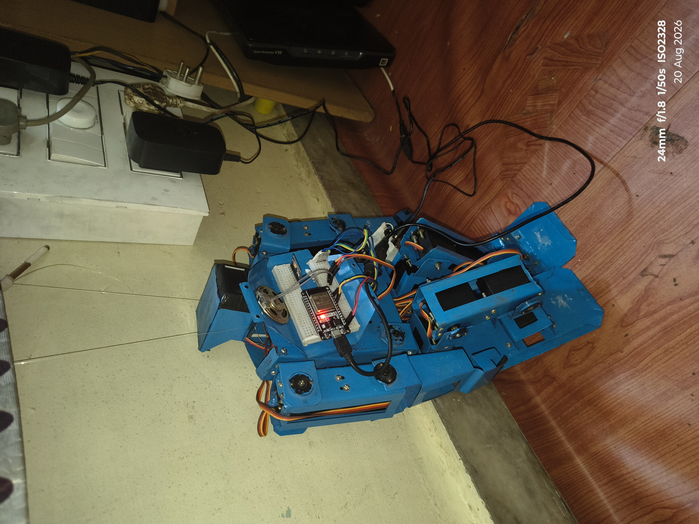
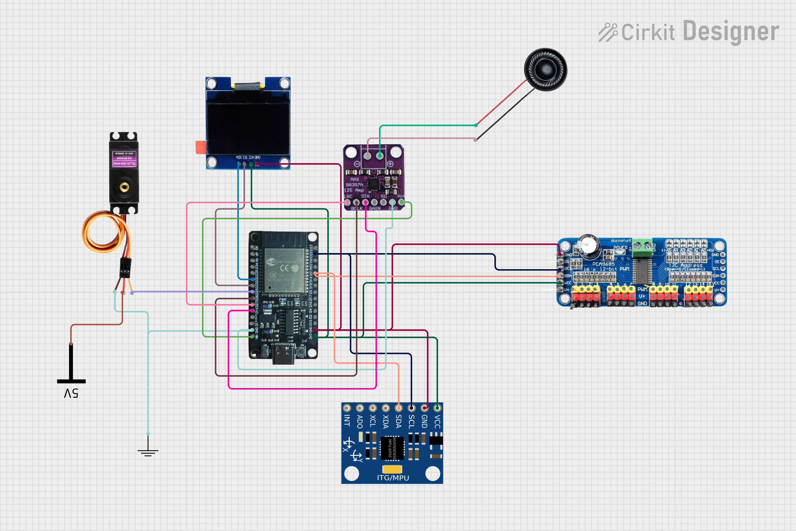
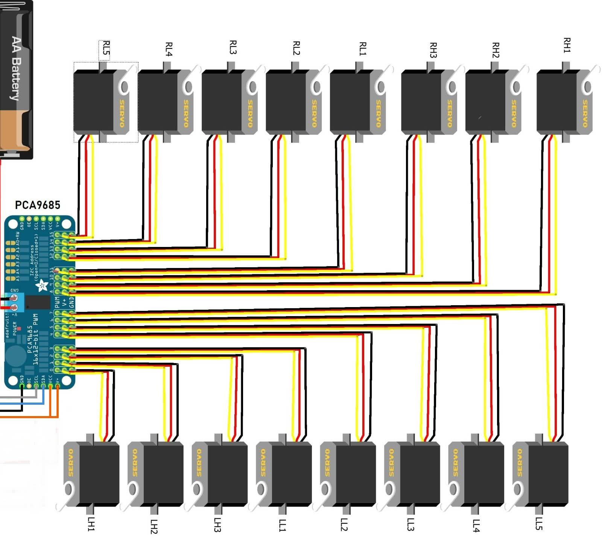
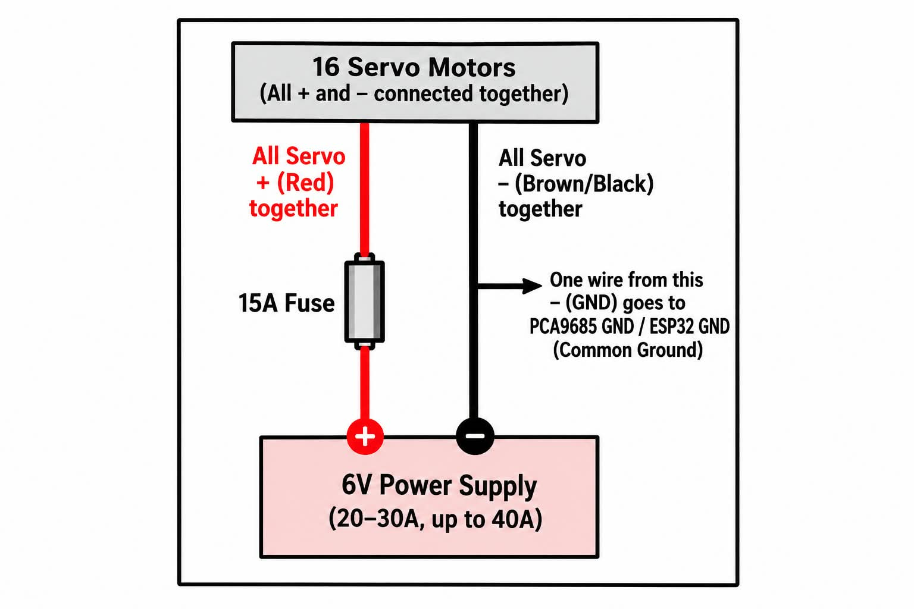
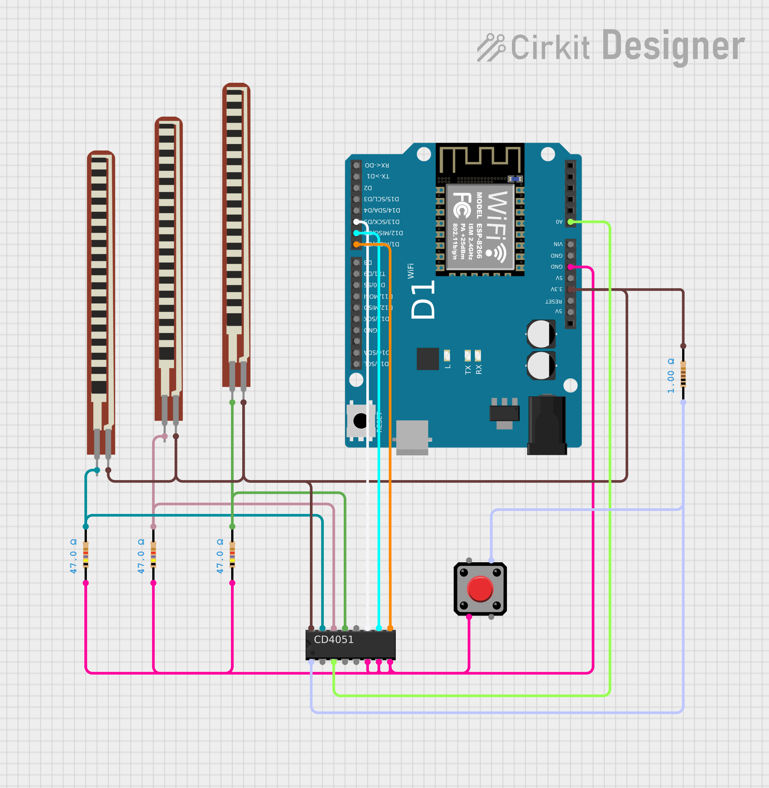
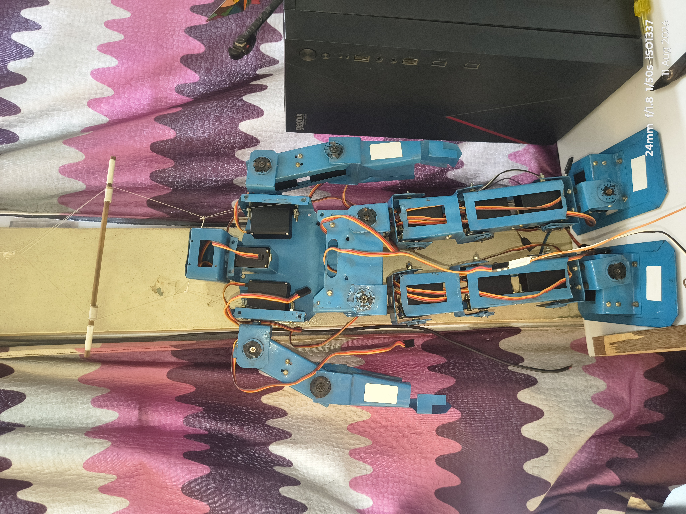
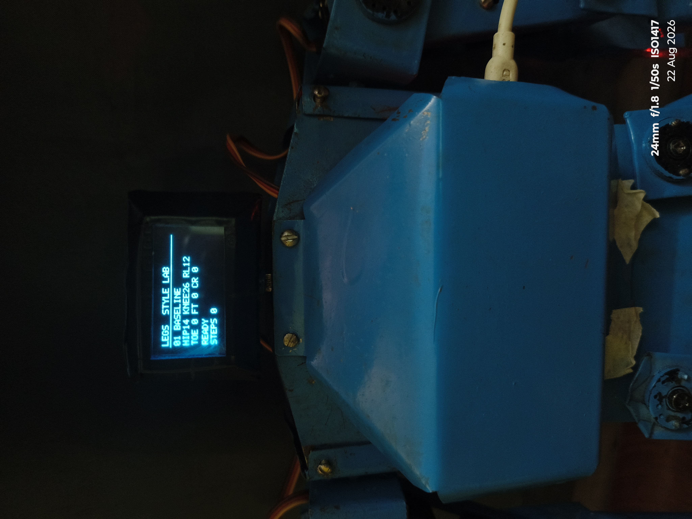
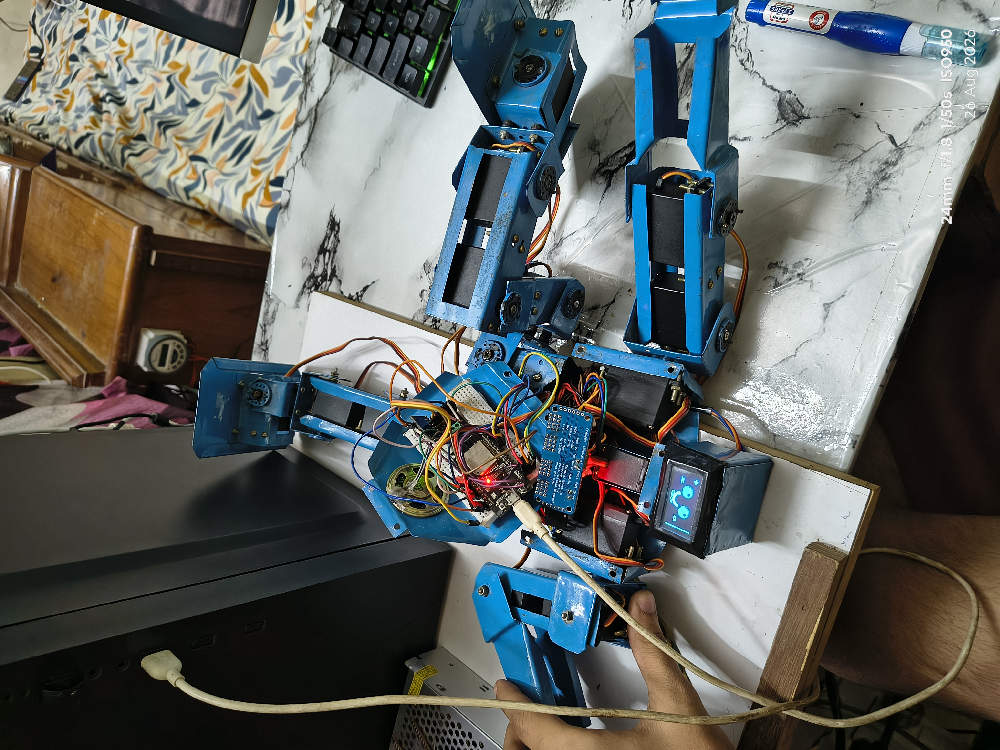
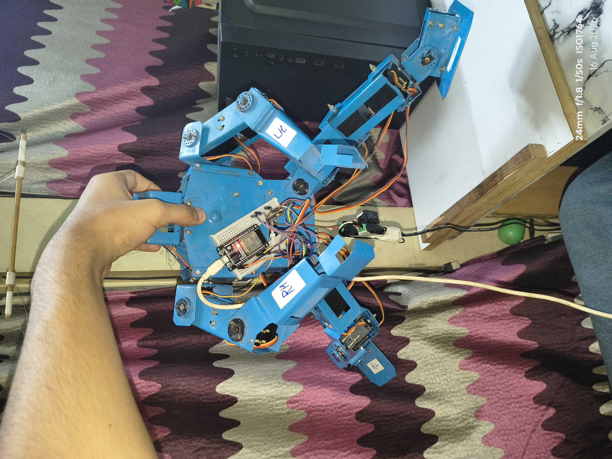
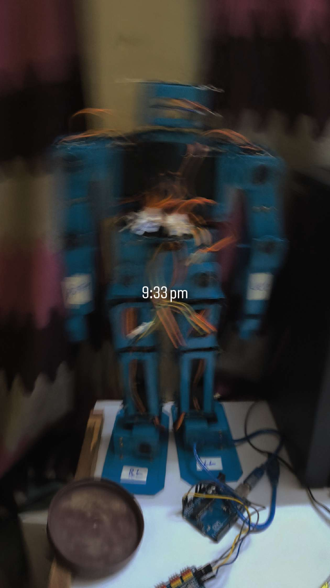

# 17-Servo Humanoid Robot

<p align="center">
  
</p>

<p align="center">
  <strong>A DIY 17-Servo Humanoid Robot</strong><br>
  Mechanical Design • Electronics • Programming • Wireless Control
</p>

<p align="center">
  <a href="#overview">Overview</a> •
  <a href="#features">Features</a> •
  <a href="#hardware">Hardware</a> •
  <a href="#circuit-diagrams">Circuit Diagrams</a> •
  <a href="#software">Software</a> •
  <a href="#robot-gallery">Gallery</a>
</p>

---

## Overview

The **17-Servo Humanoid Robot** is a DIY humanoid robotics project designed and built to explore servo control, embedded electronics, wireless communication, flex-sensor input, and programmable humanoid movement.

The robot uses an **ESP32-based receiver system** to control its servo motors and an **ESP8266-based hand controller** with flex-sensor input for wireless control.

This repository contains the robot's source code, circuit diagrams, photographs, and other project resources required to understand and reproduce the system.

---

## Features

- 17-servo humanoid robot
- ESP32-based robot receiver
- ESP8266-based wireless hand controller
- Flex-sensor based control
- OLED display
- Audio amplifier / speaker system
- 16 servo control system
- Dedicated power distribution for servos
- Wireless communication between controller and robot
- Custom 3D-printed mechanical structure
- Programmable humanoid movements

---

## Robot Specifications

| Specification | Details |
|---|---|
| Robot Type | Humanoid |
| Servo Motors | 17 |
| Main Controller | ESP32 |
| Hand Controller | ESP8266 |
| Input | Flex Sensors |
| Display | OLED |
| Audio | Amplifier + Speaker |
| Servo Control | PCA9685 |
| Communication | Wireless |
| Mechanical Parts | 3D Printed |

---

# Hardware

## Robot

The robot consists of:

- ESP32 development board
- PCA9685 servo driver
- 17 servo motors
- OLED display
- Audio amplifier
- Speaker
- Power supply
- Wiring and connectors
- Custom 3D-printed mechanical parts

## Hand Controller

The wireless controller consists of:

- ESP8266 development board
- Flex sensor
- Supporting resistors
- Power supply
- Control wiring

---

# Circuit Diagrams

All circuit diagrams are organized inside the `diagrams` folder.

## Receiver Diagrams

### ESP32 + OLED + Amplifier

This diagram shows the main receiver electronics, including the ESP32, OLED display, amplifier and related connections.

<p align="center">
  
</p>

### Servo Connections

This diagram shows the signal connections between the PCA9685 servo driver and the servo motors.

<p align="center">
  
</p>

### Servo Power Supply

This diagram shows how power is distributed to the servo motors.

<p align="center">
  
</p>

## Transmitter Diagram

### Flex Sensor Hand Controller

This diagram shows the ESP8266 hand controller and flex-sensor circuit.

<p align="center">
  
</p>

---

# Software

The project contains two main software components.

## 1. Humanoid Robot Receiver

The receiver software runs on the **ESP32** and controls the robot's servo motors and other connected electronics.

[Open Receiver Code](17-Servo-Humanoid-Robot/ESP32_Humanoid_Robot_RECEIVER)

## 2. Hand Controller Transmitter

The transmitter software runs on the **ESP8266** and reads the flex-sensor input before sending control commands wirelessly to the robot.

[Open Transmitter Code](17-Servo-Humanoid-Robot/ESP8266_Hand_Controller_TRANSMITTER_Y4_BUTTON)

---

# Installation

## Receiver

1. Install the Arduino IDE.
2. Install ESP32 board support.
3. Open the receiver `.ino` file.
4. Install the required libraries.
5. Select the correct ESP32 board and COM port.
6. Upload the program to the ESP32.
7. Open the Serial Monitor to verify the system.

## Transmitter

1. Install the Arduino IDE.
2. Install ESP8266 board support.
3. Open the transmitter `.ino` file.
4. Install the required libraries.
5. Select the correct ESP8266 board and COM port.
6. Upload the program.
7. Open the Serial Monitor to verify communication.

---

# Servo Configuration

The robot uses **17 servo motors** distributed across the humanoid structure.

Servo positions and movement ranges are defined in the receiver software.

Before operating the robot, make sure:

- Servo horns are installed in the correct position.
- Servo power is supplied separately from the controller when required.
- The PCA9685 connections are correct.
- Servo limits are properly calibrated.
- The robot is mechanically stable.

---

# Calibration

Servo calibration is important before performing full robot movements.

Recommended procedure:

1. Power the electronics.
2. Check the servo driver connections.
3. Test each servo individually.
4. Adjust the neutral position.
5. Verify the mechanical alignment.
6. Set safe movement limits.
7. Test individual movements.
8. Test complete movements after calibration.

Do not force a servo against its mechanical limit.

---

# Robot Gallery

## Front View

<p align="center">
  
</p>

## Final Robot

<p align="center">
  
</p>

## Display / Face

<p align="center">
  
</p>

## Electronics

<p align="center">
  
</p>

## Testing

<p align="center">
  
</p>

## Night Test

<p align="center">
  
</p>

---

# Mechanical Design

The humanoid robot uses custom-designed mechanical parts.

The complete robot design files are provided separately because the design archive is large.

## 3D Design Files

The complete `Robo_design.zip` package can be downloaded from the project's **GitHub Releases**.

> Release download link will be added here.

---

# Build Process

The robot can be built in several stages:

### 1. Mechanical Assembly

Assemble the 3D-printed body, arms, legs, head and other structural components.

### 2. Servo Installation

Install and align the servo motors according to their respective positions.

### 3. Electronics

Connect the ESP32, PCA9685, OLED, amplifier and other electronic components.

### 4. Power System

Connect the servo power distribution system and ensure the power supply is suitable for the servo load.

### 5. Controller

Build the ESP8266 hand controller and connect the flex sensor.

### 6. Programming

Upload the receiver and transmitter firmware.

### 7. Calibration

Calibrate the servos and test individual movements.

### 8. Final Testing

Test wireless control and complete humanoid movements.

---

# Downloads

## Robot Design Files

The complete 3D design package is available through GitHub Releases.

**Download:**  
> Release link will be added here.

## Source Code

- [ESP32 Humanoid Robot Receiver](17-Servo-Humanoid-Robot/ESP32_Humanoid_Robot_RECEIVER)
- [ESP8266 Hand Controller Transmitter](17-Servo-Humanoid-Robot/ESP8266_Hand_Controller_TRANSMITTER_Y4_BUTTON)

## Circuit Diagrams

All diagrams are available here:

- [Receiver Diagrams](diagrams/receiver)
- [Transmitter Diagram](diagrams/transmitter)

---

# Videos

Project videos and demonstrations will be added here.

### Robot Demonstration

> YouTube link will be added here.

### Build / Assembly

> YouTube link will be added here.

### Hand Controller Demonstration

> YouTube link will be added here.

---

# Project Structure

```text
17-Servo-Humanoid-Robot/
│
├── 17-Servo-Humanoid-Robot/
│   │
│   ├── ESP32_Humanoid_Robot_RECEIVER/
│   │   └── 2ESP32_Humanoid_Robot_RECEIVER/
│   │
│   └── ESP8266_Hand_Controller_TRANSMITTER_Y4_BUTTON/
│       └── ESP8266_Hand_Controller_TRANSMITTER_Y4_BUTTON/
│
├── diagrams/
│   │
│   ├── receiver/
│   │   ├── esp32-oled-amplifier.png.png
│   │   ├── servo-connections.png.png
│   │   └── servo-power-supply.png.png
│   │
│   └── transmitter/
│       └── flex-sensor-transmitter.png.png
│
├── images/
│   ├── robot-display.jpg.jpg
│   ├── robot-electronics.jpg.jpg
│   ├── robot-final.jpg.jpg
│   ├── robot-front.jpg.jpg
│   ├── robot-night-test.jpg.jpg
│   └── robot-testing.jpg.jpg
│
├── LICENSE
└── README.md
